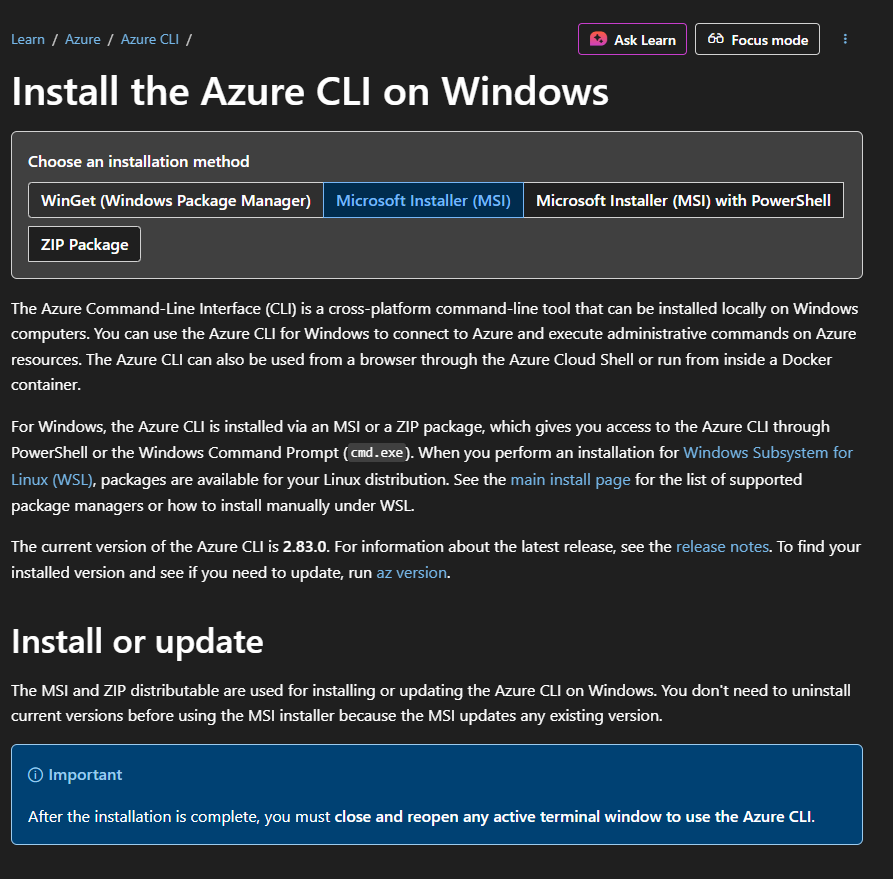
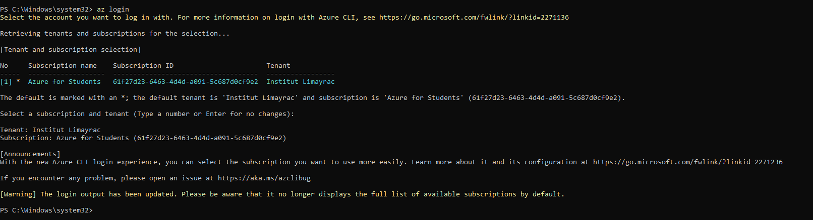
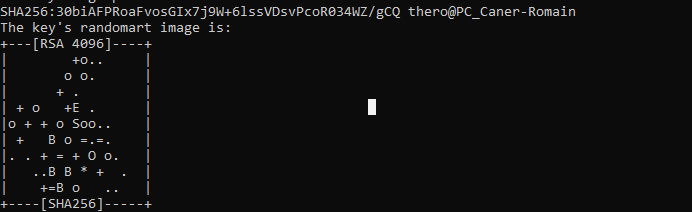
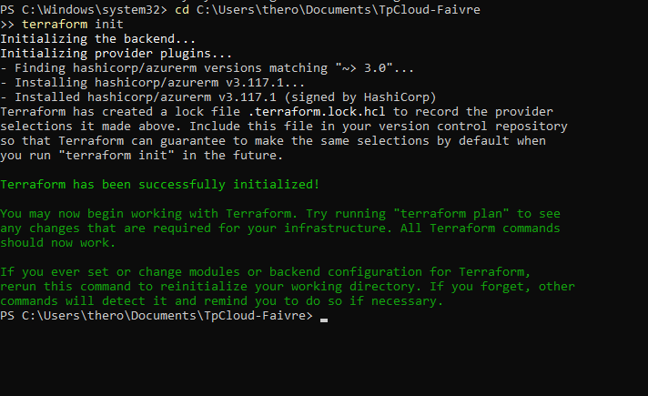
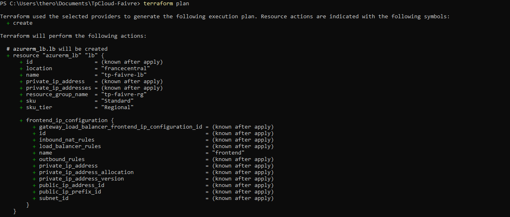
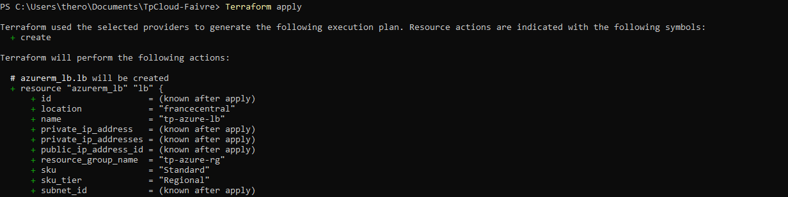
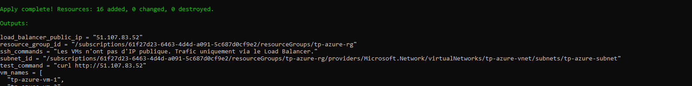
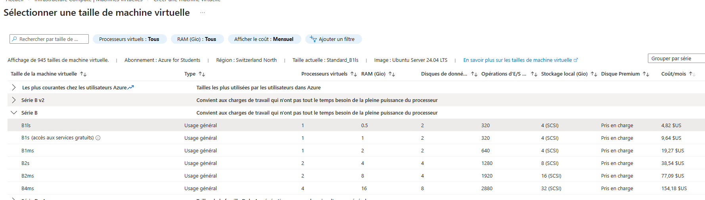

# TP Noté — Déployer 2 VMs avec Load Balancer sur Azure via Terraform

> **Auteur** : Romain Thero  
> **Établissement** : Institut Limayrac  
> **Souscription Azure** : Azure for Students  
> **Date** : Février 2026

---

## Objectif

Déployer une infrastructure Azure complète avec Terraform comprenant **2 machines virtuelles** exécutant chacune un serveur web Nginx, accessibles derrière un **Load Balancer public**, en appliquant les fondamentaux de l'Infrastructure as Code (IaC).

---

## Architecture déployée

```
Internet
   │
   ▼
┌─────────────────────────────┐
│  Load Balancer (Standard)   │
│  tp-azure-lb                │
└────────────┬────────────────┘
             │ répartit le trafic HTTP (port 80)
    ┌────────┴────────┐
    ▼                 ▼
┌────────┐       ┌────────┐
│  VM-1  │       │  VM-2  │
│ Nginx  │       │ Nginx  │
└────────┘       └────────┘
```

---

## Structure du projet

```
TpCloud-Faivre/
├── versions.tf       # Versions requises (Terraform >= 1.5.0, azurerm ~> 4.0)
├── provider.tf       # Configuration du provider Azure (auth via AZ CLI)
├── variables.tf      # Variables : location, prefix, vm_size, admin, clé SSH
├── main.tf           # Toutes les ressources Azure
├── outputs.tf        # IP du LB, IDs, commandes de test
├── SSH.txt           # Clé privée SSH (ne pas partager)
├── SSH.txt.pub       # Clé publique SSH
└── ImagesDoc/        # Captures d'écran du déploiement
```

---

## Pré-requis

- [Terraform](https://developer.hashicorp.com/terraform/install) >= 1.5.0
- [Azure CLI](https://learn.microsoft.com/fr-fr/cli/azure/install-azure-cli) installé



- Compte Azure for Students actif

---

## Étapes de déploiement

### 1. Authentification Azure

```powershell
az login
```



---

### 2. Génération de la clé SSH

```powershell
ssh-keygen -t rsa -b 4096
```



---

### 3. Initialisation de Terraform

```powershell
cd C:\Users\thero\Documents\TpCloud-Faivre
terraform init -upgrade
```



> Terraform télécharge le provider `hashicorp/azurerm` et crée le fichier `.terraform.lock.hcl`.

---

### 4. Planification

```powershell
terraform plan
```



> Le plan affiche les **16 ressources** qui seront créées. Aucune modification n'est encore effectuée.

---

### 5. Déploiement

```powershell
terraform apply
```





> **16 ressources créées, 0 modifiées, 0 détruites.**  
> L'IP publique du Load Balancer s'affiche dans les outputs : `51.107.83.52`

---

## Résultats — Validation du Load Balancer

En accédant à `http://51.107.83.52` plusieurs fois, le Load Balancer distribue le trafic alternativement entre les deux VMs :

**VM-1 répond :**


**VM-2 répond :**


> La distribution entre VM-1 et VM-2 prouve que le Load Balancer fonctionne correctement.

---

## Détail des ressources créées

| Ressource | Nom | Rôle |
|---|---|---|
| `azurerm_resource_group` | `tp-azure-rg` | Conteneur de toutes les ressources |
| `azurerm_virtual_network` | `tp-azure-vnet` | Réseau virtuel |
| `azurerm_subnet` | `tp-azure-subnet` | Sous-réseau des VMs |
| `azurerm_network_security_group` | `tp-azure-nsg` | Pare-feu |
| `azurerm_public_ip` | `tp-azure-lb-pip` | IP publique du Load Balancer |
| `azurerm_lb` | `tp-azure-lb` | Load Balancer Standard |
| `azurerm_lb_backend_address_pool` | `tp-azure-backend-pool` | Groupe des VMs cibles |
| `azurerm_lb_probe` | `tp-azure-http-probe` | Sonde de santé HTTP |
| `azurerm_lb_rule` | `tp-azure-http-rule` | Règle de répartition de charge |
| `azurerm_network_interface` x2 | `tp-azure-nic-1/2` | Cartes réseau des VMs |
| `azurerm_network_interface_backend_address_pool_association` x2 | — | Association NIC → Backend Pool |
| `azurerm_linux_virtual_machine` x2 | `tp-azure-vm-1/2` | VMs Ubuntu 22.04 LTS |

---

## Choix techniques

### Taille de VM : `Standard_B1s`
La plus petite VM disponible sur le compte Azure for Students : 1 vCPU, 1 Go RAM.



### Installation automatique de Nginx via `custom_data`
Au premier démarrage, chaque VM exécute automatiquement ce script cloud-init :

```bash
#!/bin/bash
apt-get update
apt-get install -y nginx
echo "<h1>Hello from tp-azure-vm-1</h1>" > /var/www/html/index.html
systemctl start nginx
systemctl enable nginx
```

Le script est encodé en base64 via la fonction Terraform `base64encode()`, comme exigé par l'attribut `custom_data`.

### Pas d'IP publique sur les VMs
Les NICs des VMs n'ont pas d'IP publique directe. Tout le trafic entrant passe par le Load Balancer, ce qui est la bonne pratique en production.

---

## Nettoyage

```powershell
terraform destroy
```

> Supprime toutes les ressources Azure et arrête la facturation.

---

## Sources

- Documentation Terraform : https://developer.hashicorp.com/terraform/docs
- Provider azurerm : https://registry.terraform.io/providers/hashicorp/azurerm/latest/docs
- Documentation Azure CLI : https://learn.microsoft.com/fr-fr/cli/azure/
- Tailles de VMs Azure : https://azure.microsoft.com/fr-fr/pricing/details/virtual-machines/linux/
- Cours du TP : https://formation.afaivre.fr/terraform-azure
